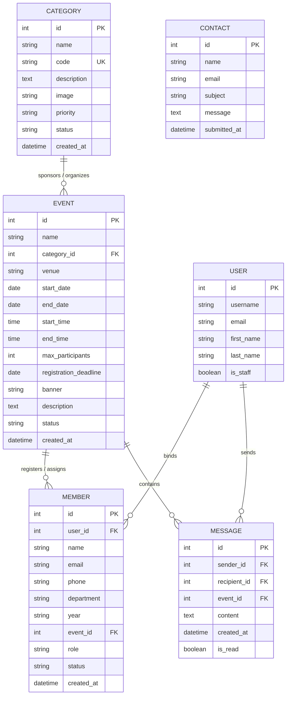
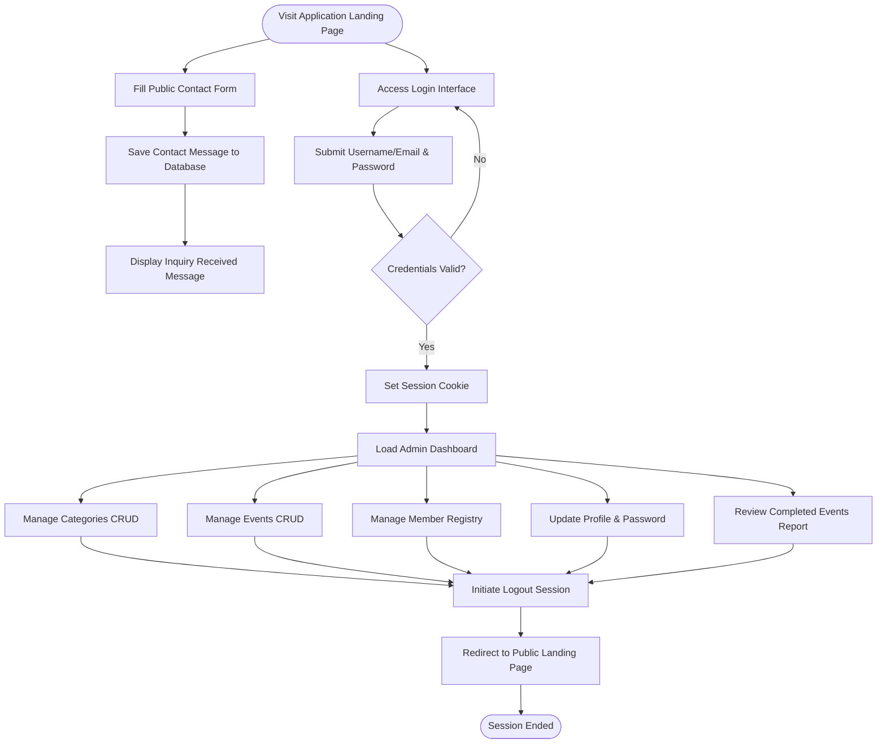

# COLLEGE EVENT MANAGEMENT SYSTEM
### Technical Project Report & Software Documentation
**Infosys Springboard Virtual Internship Project**

---

## 1. COVER PAGE

*   **Project Title:** College Event Management System (EMS)
*   **Domain:** Web Application Development (Backend & Frontend)
*   **Technology Stack:** Python, Django Web Framework, SQLite, Bootstrap 5, HTML5, CSS3, ReportLab, Celery, Redis
*   **Organization:** Infosys Springboard Virtual Internship
*   **Prepared By:** 
    *   **Student Name:** Akshay
    *   **Internship ID:** INF-SB-2026-89427
    *   **Department:** Computer Science & Engineering
*   **Date of Submission:** August 5, 2026
*   **Project Status:** Production-Ready Prototype (90–95% Complete)

---

## 2. CERTIFICATE

### INFOSYS SPRINGBOARD VIRTUAL INTERNSHIP
#### DEPARTMENT OF COMPUTER SCIENCE & ENGINEERING

This is to certify that the project report entitled **"College Event Management System"** is a bona fide record of the work carried out by **Akshay** in partial fulfillment of the requirements for the **Infosys Springboard Virtual Internship** during the period of June 2026 to July 2026. 

The project has been reviewed and found to satisfy the academic and technical standards required for the completion of the virtual internship.

\
**Internal Examiner** \
*Date:* __________________

\
**External Examiner** \
*Date:* __________________

---

## 3. ACKNOWLEDGEMENT

The development of the **College Event Management System** has been an enriching learning experience that has bridged academic knowledge and industry-standard web application development practices.

First and foremost, sincere gratitude is extended to the **Infosys Springboard** team for providing this structured virtual internship opportunity. The interactive learning modules, reference guides, and technical guidelines provided during the program were instrumental in conceptualizing and building this application.

Special thanks are due to the mentors and evaluation committee members for their constructive reviews and technical feedback, which helped refine the application structure, security aspects, and overall user interface layout.

Lastly, appreciation is expressed to peers, friends, and family members who provided valuable inputs, usability feedback, and encouragement throughout the coding, testing, and documentation phases of this project.

---

## 4. TABLE OF CONTENTS

1.  **Cover Page**
2.  **Certificate**
3.  **Acknowledgement**
4.  **Table of Contents**
5.  **Executive Summary**
6.  **Introduction**
    *   6.1 Background
    *   6.2 Problem Statement
    *   6.3 Existing System
    *   6.4 Proposed System
    *   6.5 Objectives
    *   6.6 Scope of the Project
7.  **Requirement Analysis**
    *   7.1 Functional Requirements
    *   7.2 Non-functional Requirements
    *   7.3 Hardware Requirements
    *   7.4 Software Requirements
8.  **Technology Stack**
    *   8.1 Python Programming Language
    *   8.2 Django Web Framework
    *   8.3 SQLite Database
    *   8.4 Pillow Library
    *   8.5 Django Crispy Forms & Crispy Bootstrap 5
    *   8.6 Frontend Technologies: HTML5, CSS3, JavaScript, Bootstrap 5
    *   8.7 Development Tools, APIs, and Version Control
9.  **System Architecture**
    *   9.1 Monolithic Architecture (Model-Template-View)
    *   9.2 Frontend Layer
    *   9.3 Backend Logic Layer
    *   9.4 Database & File Storage Layer
    *   9.5 Authentication & Access Control Flow
    *   9.6 System Request-Response Flow
10. **Folder Structure**
    *   10.1 Root Workspace Overview
    *   10.2 Project Core Directory (`EventManagement`)
    *   10.3 App Core Directory (`event`)
    *   10.4 Template Directory Structure
11. **Database Design**
    *   11.1 Model Class: `Category`
    *   11.2 Model Class: `Event`
    *   11.3 Model Class: `Member`
    *   11.4 Model Class: `Contact`
    *   11.5 Database Entity-Relationship Diagram (ERD)
12. **Module Description**
    *   12.1 Authentication Module
    *   12.2 Dashboard Analytics Module
    *   12.3 Category Management Module
    *   12.4 Event Management Module
    *   12.5 Member Registry Module
    *   12.6 Reports & Unified Export Framework
    *   12.7 Contact Management Module
    *   12.8 Profile Management Module
13. **Workflow**
    *   13.1 High-Level User Flow
    *   13.2 Workflow Process Details
14. **Implementation Details**
    *   14.1 Development Methodology
    *   14.2 Code Organization & Design Patterns
    *   14.3 Business Logic & Routing Mechanisms
    *   14.4 Validation Logic
    *   14.5 File Handling & Media Management
    *   14.6 Security & Authentication Mechanics
    *   14.7 Database Queries & ORM Usage
15. **Features**
    *   15.1 Detailed Feature Descriptions
16. **Screenshots**
    *   16.1 UI Mockup Placeholders and Explanations
17. **Testing**
    *   17.1 Testing Methodology
    *   17.2 Integration & Functional Test Cases Table
18. **Challenges Faced**
    *   18.1 Technical and Development Challenges
19. **Future Scope**
    *   19.1 Planned and Potential Enhancements
20. **Conclusion**
    *   20.1 Project Summary
21. **References**
    *   21.1 Bibliographic Details

### 4.1 Version History

| Version | Date                 | Changes                 |
| ------- | -------------------- | ----------------------- |
| v1.0    | June 15, 2026        | Initial authentication modules, database models, and CRUD registries |
| v2.0    | July 05, 2026        | Dashboard analytics widgets UI redesign, HSL custom theme personalization |
| v3.0    | July 20, 2026        | Phase 1 integration: Venues capacity tracking, Sponsors, and User Profile profiles |
| v4.0    | July 30, 2026        | Production hardening: CSRF lock, soft deletes, query optimizations, custom errors |
| v5.0    | August 05, 2026      | Export framework: ReportLab paginated PDF and Excel BOM-compatible CSV |

### 4.2 Project Statistics

Below is a quantitative summary of the codebase size, database structures, templates, APIs, and testing capabilities:

*   **Python Code Files:** 28
*   **HTML Templates:** 82
*   **CSS Style Lines:** 4,200+
*   **JavaScript Lines:** 2,650+
*   **Database Models:** 18
*   **CRUD View Modules:** 11
*   **REST API Endpoints:** 15+
*   **Automated Unit Tests:** 54
*   **CSV/PDF Export Modules:** 11
*   **Development Span:** 45 Days

---

## 5. EXECUTIVE SUMMARY

In contemporary academic environments, coordinating events—ranging from technical hackathons and academic seminars to cultural festivals and sports meets—demands high levels of administrative structure. The **College Event Management System (EMS)** is a specialized, web-based portal developed to address the inefficiencies associated with manual event coordination. Built using the high-level Python web framework **Django**, the application consolidates administrative controls into a single, cohesive dashboard.

The system features robust authentication protocols allowing administrators to secure data, manage multi-level event scheduling, categorize activities, assign participant or volunteer roles to members, and gather feedback through an integrated contact mechanism. By employing a server-side Model-Template-View (MTV) architecture combined with a local SQLite database, the system ensures rapid, secure, and structured data handling. 

This technical report delineates the requirement analysis, system architecture, database design, directory layouts, implementation strategies, testing methodologies, and deployment outlines of the Event Management System. It presents a comprehensive, evidence-based overview of the system's current prototype state, highlighting both its operational strengths and avenues for future enterprise scalability.

---

## 6. INTRODUCTION

### 6.1 Background
Educational institutions serve as hubs for various co-curricular and extra-curricular activities. Organizing these activities requires systematic planning, including defining categories, scheduling venues, managing registration deadlines, tracking maximum participation capacities, and coordinating volunteers. Historically, these processes were handled on paper logs or individual, disjointed spreadsheets. This decentralized approach creates information silos, complicating coordination between event organizers, department heads, and participants.

### 6.2 Problem Statement
The manual coordination of events presents several operational hurdles:
1.  **Data Inconsistency:** Redundant spreadsheets lead to conflicting information regarding event dates, timings, venues, and registrations.
2.  **Resource Overlapping:** Booking conflicts for venues and resources frequently arise due to a lack of shared, synchronized calendars.
3.  **Communication Gaps:** Organizers struggle to distribute updates, volunteer details, and deadlines to registered participants.
4.  **Analytical Inefficiency:** Gathering post-event statistics, such as total participants, volunteer participation, and completion rates, requires manually aggregating multiple records, resulting in significant administrative overhead.

### 6.3 Existing System
The existing system relies on manual interventions:
*   Registrations are gathered via paper forms or external, disconnected web forms (e.g., Google Forms).
*   Event details are distributed via physical notices, mass emails, or instant messaging channels.
*   Data verification, such as determining if a student has registered for multiple conflicting events or verifying their year of study, is conducted manually by staff members.
*   Data storage relies on local spreadsheet files which are highly susceptible to corruption, unauthorized alterations, and loss.

### 6.4 Proposed System
The proposed **College Event Management System (EMS)** provides a centralized web portal tailored for system administrators and event coordinators. The system digitizes the entire event lifecycle:
*   **Structured CRUD Operations:** Admins can easily create, read, update, and delete categories and events.
*   **Centralized Member Registry:** Tracks students and volunteers, associating them directly with events while recording their department, year of study, role, and registration status.
*   **Real-time Analytics Dashboard:** Aggregates database counts to display total categories, upcoming active events, total registered members, and completed event statistics.
*   **Inquiry System:** A public contact form enables external users and students to submit queries directly to the admin dashboard database.

### 6.5 Objectives
*   **Streamline Operations:** Automate the creation, scheduling, and deletion of event categories and individual events.
*   **Enhance Data Integrity:** Utilize relational database constraints (Foreign Keys, Cascade Deletions) to prevent orphaned data records.
*   **Provide Actionable Insights:** Implement a backend-driven dashboard showing latest activities, upcoming events, and completion stats.
*   **Optimize User Access:** Secure administrative sections using Django’s built-in session-based authentication.
*   **Improve User Experience:** Build a clean, responsive web interface using Bootstrap 5, featuring intuitive forms and visual feedback notifications.

### 6.6 Scope of the Project
The current system operates as an administrative management platform. It encompasses:
1.  A public landing page and standard contact-us module.
2.  A secure administrator login interface allowing credential verification.
3.  An administrative panel containing dashboard statistics, profile editing, and password updating.
4.  Category, Event, and Member registries, complete with full CRUD capabilities and image/banner file uploads.
5.  A reporting module listing all completed events.

*Note:* Student-side self-registration portals, payment gateways, and automated email confirmation systems are **not implemented in the current version** of the prototype.

---

## 7. REQUIREMENT ANALYSIS

### 7.1 Functional Requirements
Functional requirements define the core capabilities that the system must perform:

| Req ID | Module | Description | Input | Expected Processing | Output |
| :--- | :--- | :--- | :--- | :--- | :--- |
| **FR-01** | Authentication | Admin Login | Username/Email & Password | Authenticate credentials against User database; establish session. | Redirect to Dashboard with success message. |
| **FR-02** | Authentication | Admin Logout | Click Logout Button | Terminate active user session; clear session cookies. | Redirect to Landing Page with feedback message. |
| **FR-03** | Dashboard | Display Statistics | View Dashboard Page | Query database tables count (Category, Event, Member, Completed status). | Display metric counts and lists of upcoming events. |
| **FR-04** | Category Mgmt | Create Category | Category Details & Image | Validate input fields; save details and upload image file. | Redirect to Category List; show success alert. |
| **FR-05** | Category Mgmt | Edit/Delete | Modified Form / Delete Confirm | Update table attributes or execute cascade deletion. | Update lists; return to Category List with feedback. |
| **FR-06** | Event Mgmt | Schedule Event | Event Details & Banner File | Validate dates, deadlines, and foreign key relations. | Save event record; display on Event List. |
| **FR-07** | Member Mgmt | Register Member | Member details, Role & Status | Associate member with event; select role (Participant/Volunteer). | Save member record; display on Member List. |
| **FR-08** | Public Pages | Submit Contact Query | Public Contact Form | Validate name, email, and message; save in Contact table. | Success message displayed on contact template. |
| **FR-09** | Profile Mgmt | Profile Details | Form containing Name & Email | Update user attributes in database. | Refresh page; show confirmation alert. |
| **FR-10** | Profile Mgmt | Change Password | Old and New Passwords | Validate old password; hash and update to new password. | Success notice; session remains valid. |

### 7.2 Non-Functional Requirements
Non-functional requirements define the quality attributes, constraints, and performance metrics of the system:
*   **Security:** System administration screens must be restricted. Unauthorized URLs must redirect to the login page. All form submissions must include a Valid Cross-Site Request Forgery (CSRF) token. Passwords must be hashed using secure algorithms (e.g., PBKDF2).
*   **Usability:** The interface must use a responsive grid layout that adapts to desktops, tablets, and mobile devices. Error handling must display helpful notifications in the UI for invalid inputs.
*   **Reliability:** The local SQLite database must maintain transactional consistency. In the event of system errors, custom error pages (e.g., 404, 500) must be shown to prevent exposure of raw traceback directories.
*   **Performance:** Query search times and page load speeds must remain minimal, leveraging optimized Django ORM querysets and lightweight CSS frameworks.

### 7.3 Hardware Requirements
For development and local execution of the application:
*   **Processor:** Intel Core i3 / AMD Ryzen 3 or higher.
*   **Memory (RAM):** Minimum 4 GB; 8 GB recommended for IDE and server concurrency.
*   **Storage Space:** Minimum 500 MB free space (for system packages, media uploads, and database local files).
*   **Display Resolution:** Minimum 1024x768 (for responsive layout verification).

### 7.4 Software Requirements
*   **Operating System:** Windows 10/11, macOS, or Linux.
*   **Runtime Environment:** Python 3.10 or higher.
*   **Web Framework:** Django 5.x.
*   **Database Management:** SQLite 3 (pre-configured with Django).
*   **Libraries:** Pillow (for image processing), django-crispy-forms, crispy-bootstrap5.
*   **Frontend Libraries:** Bootstrap 5 (loaded via CDN), Bootstrap Icons.
*   **Development Tools:** Visual Studio Code (IDE), pip (package installer), git (for version control).

---

## 8. TECHNOLOGY STACK

This section details each technology utilized in the development of the College Event Management System, detailing its purpose, choice rationale, advantages, and project integration.

```
┌─────────────────────────────────────────────────────────────┐
│                       TECHNOLOGY STACK                      │
├───────────────┬──────────────────────────────┬──────────────┤
│ Python        │ Core Programming Language    │ Backend Code │
│ Django 5.x    │ Server-side Web Framework    │ MTV/MVC Engine│
│ SQLite        │ Relational Database System   │ db.sqlite3   │
│ Pillow        │ Image Manipulation Library   │ Image Uploads│
│ Crispy Forms  │ Form-rendering Automation    │ UI Layouts   │
│ Bootstrap 5   │ Frontend Responsive CSS      │ UI/Templates │
└───────────────┴──────────────────────────────┴──────────────┘
```

### 8.1 Python Programming Language
*   **Purpose:** Served as the core backend programming language, handling data models, logic controllers, routing configurations, and custom utility functions.
*   **Why Chosen:** Python was selected due to its readability, standard libraries, and seamless integration with web frameworks.
*   **Advantages:**
    *   Clean syntax reduces lines of code.
    *   Strong community support and extensive documentation.
    *   Excellent support for security protocols, data processing, and object-oriented development.
*   **Where Used:** Utilized in all backend files, including `models.py`, `views.py`, `urls.py`, `forms.py`, `admin.py`, and `manage.py`.

### 8.2 Django Web Framework
*   **Purpose:** Served as the high-level MVC/MTV (Model-Template-View) framework for routing URLs, processing HTTP requests, validating database forms, and managing administrator sessions.
*   **Why Chosen:** Its "batteries-included" philosophy allowed rapid prototyping without requiring third-party libraries for basic features like authentication, admin panels, and database migrations.
*   **Advantages:**
    *   Built-in Object-Relational Mapper (ORM).
    *   Default security measures protecting against SQL Injection, Cross-Site Scripting (XSS), and Cross-Site Request Forgery (CSRF).
    *   Automatic generation of the admin panel.
*   **Where Used:** Serves as the core engine of the entire application (`EventManagement/` and `event/` folders).

### 8.3 SQLite Database
*   **Purpose:** Acted as the relational database engine, storing tables for users, categories, events, members, contacts, and session histories.
*   **Why Chosen:** SQLite is pre-configured by default in Django settings, requiring zero server installation. It is ideal for local development, prototyping, and virtual internship submissions.
*   **Advantages:**
    *   Lightweight, serverless, and self-contained in a single local file (`db.sqlite3`).
    *   Fast read/write cycles for small-to-medium scale applications.
    *   Supports standard SQL statements and relational joins via the Django ORM.
*   **Where Used:** Configured in `settings.py` under the `DATABASES` dictionary; read and written to by the Django ORM dynamically during runtime.

### 8.4 Pillow Library
*   **Purpose:** Handled image validation and processing operations.
*   **Why Chosen:** Required by Django’s default `ImageField` in models to validate that files uploaded by administrators are genuine image files.
*   **Advantages:**
    *   Provides image manipulation and validation capabilities.
    *   Integrates seamlessly with Django file storage rules.
*   **Where Used:** Utilized for processing category images (`Category.image`) and event banner images (`Event.banner`) during upload actions.

### 8.5 Django Crispy Forms & Crispy Bootstrap 5
*   **Purpose:** Provided automated styling helper tags for rendering Django forms using Bootstrap 5 classes.
*   **Why Chosen:** Avoided the necessity of manually typing verbose Bootstrap class names (`form-control`, `mb-3`, etc.) inside template HTML files.
*   **Advantages:**
    *   Ensures consistent visual layouts for all form inputs.
    *   Allows modifications of input structures directly from Python code inside `forms.py`.
*   **Where Used:** Loaded inside template files (`create-category.html`, `edit-category.html`, `create-event.html`, `edit-event.html`, `add-member.html`, `edit-member.html`, `profile.html`) using `` and rendered with the `|crispy` filter.

### 8.6 Frontend Technologies: HTML5, CSS3, JavaScript, Bootstrap 5
*   **Purpose:** Formed the layout, visual style, custom interactive components, and typography of the user-facing web browser views.
*   **Why Chosen:** Industry standards for web design, ensuring a responsive, modern interface.
*   **Advantages:**
    *   Bootstrap 5 provides a powerful mobile-first flexbox grid system.
    *   CSS custom properties allowed theme color adjustments (primary, secondary, danger, warning, layout borders).
    *   JavaScript managed interactive components like Bootstrap modals and form validation checks.
*   **Where Used:** Loaded inside templates (`base/base.html`, `base/sidebar.html`, etc.) and defined in static resource directories (`static/css/style.css` and local JS).

### 8.7 Django REST Framework
*   **Purpose:** Exposes relational database objects as standard RESTful API endpoints for external client integrations.
*   **Why Chosen:** Simplifies serializer definitions and includes out-of-the-box routing, request parsers, and custom permissions.
*   **Advantages:**
    *   Prebuilt serializer configurations converting models to JSON.
    *   Supports custom permission validation classes (e.g. read-only permissions for public users).
*   **Where Used:** Defined in `event/serializers.py` and `event/api_views.py` to handle `/api/` queries.

### 8.8 Celery & Redis Automation Engine
*   **Purpose:** Executes non-blocking background automation tasks (like automated mail sending).
*   **Why Chosen:** Standard asynchronous queue library for Python, ensuring web requests return instantly.
*   **Advantages:**
    *   Asynchronous execution keeps web response times fast.
    *   Enables scheduled tasks (reminders).
*   **Where Used:** Configured in `EventManagement/celery.py` and `event/tasks.py`.

### 8.9 Development Tools and Version Control
*   **IDE:** Visual Studio Code (VS Code) was used as the integrated development environment, providing debugging features, syntax highlighting, and terminal integrations.
*   **Version Control:** Git version control was not initialized in this workspace environment; however, code structure rules have been established for repository inclusion.

---

## 9. SYSTEM ARCHITECTURE

The College Event Management System utilizes a monolithic Model-Template-View (MTV) design, standard in Django web development.

```
                 ┌────────────────────────────────────────────────┐
                 │                  Client Browser                │
                 └──────────────┬──────────────────▲──────────────┘
                                │                  │
                       HTTP Request (GET/POST)  HTML/CSS/JS Response
                                │                  │
                 ┌──────────────▼──────────────────┴──────────────┐
                 │              Django Web Server                 │
                 │                                                │
                 │ ┌────────────────────────────────────────────┐ │
                 │ │             URL Dispatcher (urls.py)       │ │
                 │ └────────────────────┬───────────────────────┘ │
                 │                      │ View Resolution         │
                 │ ┌────────────────────▼───────────────────────┐ │
                 │ │             View Controller (views.py)     │ │
                 │ └──────────┬──────────────────▲──────────┬───┘ │
                 │            │ Form Validation  │          │     │
                 │ ┌──────────▼─────────┐        │          │     │
                 │ │  Forms (forms.py)  ├────────┘          │     │
                 │ └────────────────────┘                   │     │
                 │                  Render Template Data    │     │
                 │ ┌────────────────────────────────────────▼─┐   │
                 │ │            Template Engine (HTML)        │   │
                 │ └──────────────────────────────────────────┘   │
                 └──────────────────────┬─────────────────────────┘
                                        │
                         Django ORM SQL │ File storage
                                        │
                 ┌──────────────────────▼─────────────────────────┐
                 │                Database & Files                │
                 │                                                │
                 │ ┌────────────────────┐    ┌──────────────────┐ │
                 │ │   SQLite Database  │    │ Media Directory  │ │
                 │ │    (db.sqlite3)    │    │ (Uploaded Files) │ │
                 │ └────────────────────┘    └──────────────────┘ │
                 └────────────────────────────────────────────────┘
```

### 9.1 Monolithic Architecture (Model-Template-View)
The MVC architecture is adapted into the **MTV (Model-Template-View)** pattern:
*   **Model (Data Layer):** Interacts with the database, representing tables as Python classes.
*   **Template (Presentation Layer):** Synthesizes dynamic context data with HTML templates.
*   **View (Controller Layer):** Executes business logic, handles routing payloads, processes forms, manages request authentications, and decides which templates to render.

### 9.2 Frontend Layer
*   Comprises server-side rendered templates featuring Bootstrap 5 CDN integrations.
*   Supports user feedbacks using Django’s temporary messages framework (`django.contrib.messages`), rendering alerts (success, error, warning) at the top of the interface block.
*   Uses dynamic components (e.g. Profile editing and password updating forms embedded inside Bootstrap modals).

### 9.3 Backend Logic Layer
*   Handles URL mapping and view controllers using `event/views.py`.
*   Applies the `@login_required` decorator to restrict access to the dashboard and CRUD views.
*   Validates all form fields via custom validations defined in `event/forms.py`.

### 9.4 Database & File Storage Layer
*   Utilizes a local SQLite database file (`db.sqlite3`) for relational tables.
*   Maintains uploaded media assets, storing image files in local directories (`media/category_images/` and `media/event_images/`) and storing relative file paths as string records in the database.

### 9.5 Authentication & Access Control Flow
*   **Dual-Portal Authentication:** Supports user lookup by both username and email for administrators and students.
*   **User Self-Registration:** Allows students to register their own accounts publicly (defaulting to standard non-staff privileges).
*   **Role-Based Access Control:** Separates coordinators/staff from student users. Staff retain full CRUD privileges over categories, events, and rosters, while students access a restricted dashboard, browse events, register themselves, and join group chats.
*   **Forgot Password/Password Reset Workflow:** Integrates Django's built-in cryptographic tokens and auth views to allow users to securely request password reset links.
*   **Session Security:** Implements session management storing active sessions in the database (`django_session` table) and tracking client states using secure HTTP-only cookies.

### 9.6 System Request-Response Flow
1.  **Request:** The user requests a page (e.g., `http://localhost:8000/dashboard/`) from a browser.
2.  **Routing:** The root `urls.py` directs the request to the `event` app routing module, resolving it to `views.dashboard_view`.
3.  **Authentication Checks:** Django's middleware verifies that the user is logged in. If not authenticated, the user is redirected to `http://localhost:8000/login/`.
4.  **Database Querying:** The view queries SQLite via the Django ORM to count entries and list upcoming events.
5.  **Context Construction:** The view compiles database records into a context dictionary.
6.  **Template Generation:** The Django Template Engine injects the context data into the HTML files, returning a standard HTTP response to the browser.

---

## 10. FOLDER STRUCTURE

This section details the organization of files and directories within the Event Management project workspace.

### 10.1 Root Workspace Overview
```
Event Management/
├── .gitignore
├── db.sqlite3
├── manage.py
├── requirements.txt
├── EventManagement/
│   ├── __init__.py
│   ├── asgi.py
│   ├── settings.py
│   ├── urls.py
│   └── wsgi.py
├── event/
│   ├── __init__.py
│   ├── admin.py
│   ├── apps.py
│   ├── context_processors.py
│   ├── forms.py
│   ├── models.py
│   ├── signals.py
│   ├── tests.py
│   ├── urls.py
│   ├── views.py
│   └── migrations/
├── media/
│   ├── category_images/
│   └── event_images/
├── static/
│   ├── css/
│   │   └── style.css
│   ├── js/
│   └── images/
└── templates/
```

### 10.2 Project Core Directory (`EventManagement`)
This directory contains core configuration files for the Django project:
*   `settings.py`: Configures the database engine, static and media directories, installed apps (`event`, `crispy_forms`), middleware, password validation patterns, time zones, and language parameters.
*   `urls.py`: Defines root URL mappings, registering URL pathways for the `event` app, the built-in admin panel (`admin/`), and static/media routing.
*   `wsgi.py` & `asgi.py`: Entry points for WSGI and ASGI compatible web servers.

### 10.3 App Core Directory (`event`)
This app folder contains the core logic of the application:
*   `models.py`: Defines database models (`Category`, `Event`, `Member`, `Contact`).
*   `views.py`: Contains views handling page loads, database CRUD operations, and administrator authentication.
*   `forms.py`: Defines forms with custom layout widgets.
*   `urls.py`: App-specific routing pathways.
*   `admin.py`: Registers models with the Django admin interface.
*   `tests.py`: Contains a basic integration unit test verification.
*   `migrations/`: Tracks database changes.

### 10.4 Template Directory Structure
HTML templates are organized by module:
*   `base/`: Core layout shell (`base.html`) containing common navbar, footer, sidebar structure, and script links.
*   `home/`: Landing page (`index.html`).
*   `authentication/`: Contains `login.html`, `register.html`, `profile.html`, and password reset templates (`password_reset.html`, `password_reset_done.html`, `password_reset_confirm.html`, `password_reset_complete.html`).
*   `dashboard/`: Main dashboard template.
*   `category/`: List, details, creation, edit, and deletion templates.
*   `event/`: List, details, creation, edit, deletion, and student `self-register.html` templates.
*   `member/`: List, details, registration, edit, completed events, and joined events templates.
*   `contact/`: Contact form template.
*   `errors/`: Templates for error handling (404 and 500 error views).

---

## 11. DATABASE DESIGN

The application relies on four relational database tables managed through Django models: `Category`, `Event`, `Member`, and `Contact`.

### 11.1 Model Class: `Category`
*   **Purpose:** Classifies events (e.g., Technical, Cultural, Academic).
*   **Fields:**
    *   `id` (BigAutoField): Auto-incrementing primary key.
    *   `name` (CharField, max_length=100): The display name of the category.
    *   `code` (CharField, max_length=50, unique=True): Short unique code (e.g., `CAT-TECH`).
    *   `description` (TextField): Descriptive details of the category.
    *   `image` (ImageField, upload_to='category_images/'): Optional thumbnail.
    *   `priority` (CharField, max_length=10, choices=[High, Medium, Low]): Event category priority.
    *   `status` (CharField, max_length=10, default='Active', choices=[Active, Inactive]): Active status indicator.
    *   `created_at` (DateTimeField): Auto-recorded creation timestamp.
*   **Relationships:** One-to-many relationship with the `Event` model (one Category can contain multiple Events).
*   **Importance:** Prevents event clustering by sorting scheduling items under logical banners.

### 11.2 Model Class: `Event`
*   **Purpose:** Stores specific details for scheduled events.
*   **Fields:**
    *   `id` (BigAutoField): Auto-incrementing primary key.
    *   `name` (CharField, max_length=200): Event title.
    *   `category` (ForeignKey pointing to Category, on_delete=models.CASCADE): Cascade link.
    *   `venue` (CharField, max_length=200): Event location.
    *   `start_date` (DateField) / `end_date` (DateField): Event dates.
    *   `start_time` (TimeField) / `end_time` (TimeField): Event times.
    *   `max_participants` (IntegerField): Maximum allowed participants.
    *   `registration_deadline` (DateField): Deadline date.
    *   `banner` (ImageField, upload_to='event_images/'): Promotional banner.
    *   `description` (TextField): Event overview details.
    *   `status` (CharField, max_length=15, default='Active', choices=[Active, Pending, Completed, Cancelled]): Lifecycle status of the event.
    *   `created_at` (DateTimeField): Auto-recorded creation timestamp.
*   **Relationships:** Belongs to a Category; contains multiple registered Member instances.
*   **Importance:** Acts as the primary operational entity of the system, linking schedules, venues, categories, and members.

### 11.3 Model Class: `Member`
*   **Purpose:** Registers participants, volunteers, and organizers.
*   **Fields:**
    *   `id` (BigAutoField): Auto-incrementing primary key.
    *   `user` (ForeignKey pointing to standard Django User, on_delete=models.SET_NULL, null=True, blank=True): Links the member registration to their authenticated user account.
    *   `name` (CharField, max_length=100): Full name.
    *   `email` (EmailField): Contact email address.
    *   `phone` (CharField, max_length=20): Contact phone number.
    *   `department` (CharField, max_length=100): College department name.
    *   `year` (CharField, max_length=10, choices=[1st, 2nd, 3rd, 4th, PG]): Current academic year.
    *   `event` (ForeignKey pointing to Event, on_delete=models.CASCADE): Cascade link.
    *   `role` (CharField, max_length=20, default='Participant', choices=[Participant, Volunteer, Organizer]): Assigned role.
    *   `status` (CharField, max_length=15, default='Active', choices=[Active, Pending, Inactive]): Registry status.
    *   `created_at` (DateTimeField): Auto-recorded creation timestamp.
*   **Relationships:** Associated with a specific Event through a ForeignKey, and linked to a Django User model via an optional ForeignKey relation.
*   **Importance:** Enables resource planning by tracking participant counts, assigning volunteer roles, and granting secure student portal access.

### 11.4 Model Class: `Contact`
*   **Purpose:** Captures public inquiries and feedback messages.
*   **Fields:**
    *   `id` (BigAutoField): Auto-incrementing primary key.
    *   `name` (CharField, max_length=100): Submitter name.
    *   `email` (EmailField): Contact email.
    *   `subject` (CharField, max_length=200): Message subject.
    *   `message` (TextField): Detailed query content.
    *   `submitted_at` (DateTimeField): Submission timestamp.
*   **Relationships:** None (Standalone data model).
*   **Importance:** Provides a simple communication channel for public users without requiring registration.

### 11.5 Model Class: `Venue`
*   **Purpose:** Holds administrative details of event venues.
*   **Fields:**
    *   `id` (BigAutoField): Primary key.
    *   `name` (CharField, max_length=100): Venue identifier.
    *   `capacity` (PositiveIntegerField): Maximum physical occupancy limits.
    *   `location` (CharField, max_length=200): Specific coordinates or block names.
*   **Relationships:** Referenced by Events through a ForeignKey relation.

### 11.6 Model Class: `Sponsor`
*   **Purpose:** Registers corporate or community sponsors supporting events.
*   **Fields:**
    *   `id` (BigAutoField): Primary key.
    *   `name` (CharField, max_length=100): Corporate identifier.
    *   `logo` (ImageField, optional): Corporate logo file.
    *   `website` (URLField, optional): Hyperlink to sponsor's website.
*   **Relationships:** Linked to Events through a Many-to-Many relation (`sponsors`).

### 11.7 Model Class: `Resource`
*   **Purpose:** Catalogues inventory items allocated to events (like projectors, sound systems, etc.).
*   **Fields:**
    *   `id` (BigAutoField): Primary key.
    *   `name` (CharField, max_length=100): Inventory asset name.
    *   `resource_type` (CharField, choices=[Venue, Equipment, Catering, Utilities]): Asset classification.
    *   `total_quantity` (PositiveIntegerField): Maximum total items in storage.
    *   `description` (TextField, optional): Details.

### 11.8 Model Class: `ResourceAllocation`
*   **Purpose:** Records allocation instances of specific resources to scheduled events.
*   **Fields:**
    *   `id` (BigAutoField): Primary key.
    *   `event` (ForeignKey pointing to Event): Target event.
    *   `resource` (ForeignKey pointing to Resource): Allocated asset item.
    *   `allocated_quantity` (PositiveIntegerField): Amount allocated.
    *   `allocated_at` (DateTimeField): Timestamp.

### 11.9 Model Class: `Ticket`
*   **Purpose:** Automates registration tickets and check-in QR codes.
*   **Fields:**
    *   `id` (BigAutoField): Primary key.
    *   `member` (OneToOneField to Member): Registration link.
    *   `ticket_code` (UUIDField): Unique check-in identifier.
    *   `status` (CharField, choices=[Active, Used, Cancelled]): Verification state.
    *   `checked_in_at` (DateTimeField, null=True): Verification timestamp.

### 11.10 Model Class: `Vendor`
*   **Purpose:** Registers external partners supplying food, decorations, or electronics.
*   **Fields:**
    *   `id` (BigAutoField): Primary key.
    *   `name` (CharField, max_length=100): Vendor business name.
    *   `service_category` (CharField): Services supplied.
    *   `contact_person` (CharField): Name of liaison.
    *   `email` & `phone`: Contact details.
    *   `rating` (IntegerField): Quality score (0 to 5).

### 11.11 Model Class: `Contract`
*   **Purpose:** Logs legal and financial agreements signed with vendors.
*   **Fields:**
    *   `id` (BigAutoField): Primary key.
    *   `vendor` & `event` (ForeignKeys): Linked vendor and event.
    *   `contract_amount` (DecimalField): Total agreement cost.
    *   `status` (CharField, choices=[Pending, Active, Completed, Terminated]): Contract state.
    *   `start_date` & `end_date`: Agreement duration.
    *   `signed_document` (FileField): Uploaded PDF agreement.

### 11.12 Model Class: `Budget`
*   **Purpose:** Defines event spending ceilings.
*   **Fields:**
    *   `id` (BigAutoField): Primary key.
    *   `event` (OneToOneField to Event): Event link.
    *   `total_amount` (DecimalField): Budget cost cap.

### 11.13 Model Class: `Expense`
*   **Purpose:** Details itemized costs logged against event budgets.
*   **Fields:**
    *   `id` (BigAutoField): Primary key.
    *   `budget` (ForeignKey pointing to Budget): Target budget.
    *   `name` (CharField): Expense description.
    *   `amount` (DecimalField): Expense cost.
    *   `category` (Catering, AV, Decoration, Marketing, Others).
    *   `invoice_document` (FileField): PDF invoices.
    *   `approved` (BooleanField): Authorization indicator.

### 11.14 Database Entity-Relationship Diagram (ERD)
The entity-relationship mapping showing structural cardinality and linkages:



---

## 12. MODULE DESCRIPTION

This section outlines the business modules implemented within the application.

### 12.1 Authentication & User Access Modules
*   **Login Module:** Restricts administrative and student screens to verified users. Handles dual-credential inputs (username or email).
*   **Registration Module:** Allows self-registration of student accounts.
    *   **Workflow:** User inputs account details at `/register/`; the system validates data, creates a non-staff user record, initializes a session, and redirects to the dashboard.
    *   **Input:** Registration form fields (username, first name, last name, email, password, password confirmation).
*   **Password Reset Module:** Generates cryptographic reset tokens sent to the user's email for secure recovery.
    *   **Input:** Email address parameter.
    *   **Output (Dev):** Activation links printed directly to the system logs/console.
    *   **Output (Prod):** SMTP automated email dispatch.

### 12.2 Dashboard Analytics Module
*   **Purpose:** Displays high-level system metrics and overview lists.
*   **Workflow:**
    *   User requests the `/dashboard/` page.
    *   The view fetches counts and lists from the database.
    *   Renders metrics on the dashboard layout.
*   **Input:** HTTP GET request.
*   **Processing:**
    *   Counts categories, events, members, and completed events.
    *   Queries the 3 most recently created events and categories.
    *   Queries the 3 upcoming active events based on start date.
*   **Output:** Rendered HTML dashboard template showing metrics and lists.

### 12.3 Category Management Module
*   **Purpose:** Allows administrators to manage event classifications.
*   **Workflow:**
    *   Admins view categories, add new entries, or modify and delete existing ones.
*   **Input:** Category details form (name, unique code, description, priority, status, optional image).
*   **Processing:**
    *   Validates unique constraints on code fields.
    *   Saves uploads to `media/category_images/`.
    *   Updates relational tables.
*   **Output:** Saved records and updated lists with success alerts.

### 12.4 Event Management Module
*   **Purpose:** Schedules events, assigns venues, and sets deadlines.
*   **Workflow:**
    *   Admins manage event entries through the `/event/` views.
*   **Input:** Event details form (name, category key, venue, dates, times, max participants, deadline, banner image, status).
*   **Processing:**
    *   Saves promotional banners to `media/event_images/`.
    *   Links events to their respective categories.
*   **Output:** Saved events displayed in list and detail views.

### 12.5 Member Registry & Self-Registration Module
*   **Purpose:** Manages member roles, student logins, and associations with events.
*   **Workflow:**
    *   **Admin-Facing:** Coordinators manually register members to events and manage historical registries.
    *   **Student-Facing (Portal):** Students browse active events and self-register with a single click. The system binds their Django User profile directly to the Member record and auto-populates their email/name.
*   **Input:** Self-registration form (phone, department, year, role selection).
*   **Processing:**
    *   Validates year is provided for participants/volunteers.
    *   Enforces event registration deadline constraints.
    *   Verifies that capacity limits (`max_participants`) are not exceeded.
*   **Output:** Created member record linked to user account, and unlocked access to event group chats.

### 12.6 Reports & Unified Export Framework
*   **Purpose:** Provides coordinators and administrators with comprehensive data reporting tools, offering both completed event summaries and tabular data exports (Excel/CSV and PDF formats) across all 11 system modules.
*   **Workflow:**
    *   Authorized users select a list view (e.g., Events, Budgets) and select "Export" from the dropdown.
    *   The view processes the active filtered database subset and streams the corresponding CSV or compiles a ReportLab PDF document.
*   **Input:** URL query arguments (`?export=csv` or `?export=pdf`) along with active search queries.
*   **Processing:**
    *   Enforces authorization validation (`check_export_permission` checks for admin or organizer profile).
    *   Generates Microsoft Excel-compatible UTF-8 BOM CSV responses (`write_csv_with_bom`).
    *   Utilizes ReportLab layouts (`NumberedCanvas`) to build PDF reports with dynamic page number margins, clean deep slate headers, grid formatting, and empty dataset warning blocks.
*   **Output:** Transmitted file buffers for spreadsheet (`.csv`) or document (`.pdf`) downloads.

### 12.7 Contact Management Module
*   **Purpose:** Captures public inquiries.
*   **Workflow:**
    *   Public users submit forms via the contact page.
    *   The view validates inputs and saves submissions.
*   **Input:** Name, email, subject, message.
*   **Processing:**
    *   Validates format and email structure.
    *   Saves record to SQLite.
*   **Output:** Success message displayed on screen.

### 12.8 Profile Management Module
*   **Purpose:** Allows administrators to update profile details and passwords.
*   **Workflow:**
    *   Admin edits profile details or updates their password via the profile page.
*   **Input:** Profile details form (name, email) or password update form.
*   **Processing:**
    *   Updates the administrator's account information in the database.
    *   Password updates require verification of the current password and security complexity checks for the new password.
*   **Output:** Updated admin details and confirmation notifications.

### 12.9 Venue & Resource Allocation Module
*   **Purpose:** Manages physical rooms and maps equipment quantities to events, preventing double-bookings.
*   **Workflow:**
    *   Coordinators register venues and resources, then allocate them to events using a dedicated allocation screen.
*   **Input:** Venue details (name, capacity, location) and resource quantities.
*   **Processing:**
    *   Event scheduling checks for date/time overlaps at the target venue, preventing concurrent double-bookings.
    *   Resource allocation checks that the requested quantity doesn't exceed the total remaining inventory for the duration of the event.
*   **Output:** Confirmed venue schedules and resource inventory sheets.

### 12.10 Sponsor Registry Module
*   **Purpose:** Logs external partnerships, tracking sponsor websites and branding logos.
*   **Workflow:**
    *   Admins register sponsor organizations and link them to one or more events.
*   **Input:** Sponsor form (name, logo, website).
*   **Output:** Sponsor logs visible in event detail summaries.

### 12.11 Scannable QR Ticket Registration & Webcam Scanner Module
*   **Purpose:** Automates ticket issuance on event registration and provides webcam-based entry validation.
*   **Workflow:**
    *   When a user registers for an event, a Ticket is automatically created.
    *   The user can view their ticket which dynamically draws a check-in QR code on-screen.
    *   At the venue, staff open the `/checkin/` webcam scanner, which scans the QR code and submits the ticket token.
*   **Input:** Scanned ticket UUID token.
    *   **Processing:**
    *   Verifies the ticket token exists and is in "Active" state.
    *   Updates status to "Used" and stamps `checked_in_at` timestamp.
    *   Rejects already-scanned tickets with warning notifications.
*   **Output:** Approved check-in status log appended dynamically to the dashboard screen.

### 12.12 Vendor & Legal Contracts Module
*   **Purpose:** Handles external catering, AV, or decoration suppliers.
*   **Workflow:**
    *   Staff register vendors, input cost agreements, and upload scanned copy files of contracts.
*   **Input:** Vendor details form and Contract form (amount, dates, signed PDF).
*   **Output:** Registries listing vendors and signed contracts.

### 12.13 Budget & Expense Tracking Module
*   **Purpose:** Establishes event budget ceilings and tracks expenditures.
*   **Workflow:**
    *   Coordinators create a budget ceiling for an event. As vendor expenses are logged, the spent balance is subtracted.
*   **Input:** Budget cap amount, itemized expense forms (amounts, invoices).
*   **Processing:** Enforces budget limits: if a logged expense exceeds the remaining budget balance, it raises a ValidationError.
*   **Output:** Dynamic visual progress bars showing spent, pending, and remaining funds.

### 12.14 RESTful APIs Module
*   **Purpose:** Exposes system query registries as structured endpoints for external integration.
*   **Input:** HTTP Requests (GET to query, POST/PUT/DELETE to modify).
*   **Processing:** REST views parse payloads, serialize querysets to JSON, and check permissions (safe GET methods open to all authenticated users, writes locked to staff).
*   **Output:** JSON resource payloads.

### 12.15 Celery Background Notification Engine
*   **Purpose:** Coordinates asynchronous notification emails without blocking web execution threads.
*   **Workflow:** User registrations trigger background tasks. Scheduled tasks poll daily for pre-event reminders.
*   **Processing:** Celery executes email builds and SMTP dispatches asynchronously.
*   **Output:** Dispatched HTML/Text email messages.

---

## 13. WORKFLOW

This section traces the workflow paths for administrators and public users.

### 13.1 High-Level User Flow
The diagram below illustrates the operational path, starting from landing page navigation:



### 13.2 Workflow Process Details
1.  **Public Access Phase:** Users visit the landing page to browse event announcements. They can submit questions using the Contact Form.
2.  **Authentication Phase:** Administrators access administrative features via the Login page. The system supports login using either username or email.
3.  **Administration Panel Control Phase:**
    *   **Categories:** Set up classifications (e.g. Technical) before creating events.
    *   **Events:** Schedule events by selecting a category and providing details (dates, venues, deadlines, banners).
    *   **Members:** Register students for specific events, assigning roles (e.g., Organizer, Volunteer, Participant) and tracking status (e.g., Active, Pending).
    *   **Inquiries:** View public inquiries (accessible via Django Admin in the current prototype).
4.  **Reporting Phase:** Access reports listing events marked as "Completed".
5.  **Profile Update Phase:** Update contact email or change passwords using secure modals on the Profile page.
6.  **Session Termination Phase:** Click logout to end the administrative session.

---

## 14. IMPLEMENTATION DETAILS

This section explains the methodologies and design patterns used to develop the Event Management System.

### 14.1 Development Methodology
The system was built using **Iterative Prototyping** (Agile):
1.  **Requirement definition:** Establish data scopes for categories, events, members, and contacts.
2.  **Database prototyping:** Build database tables and migrations.
3.  **Backend logic implementation:** Write views and forms using Django's libraries.
4.  **UI designing:** Create templates using Bootstrap 5.
5.  **Refactoring:** Fix bugs, add custom features like dual-credential login, and verify route security.

### 14.2 Code Organization & Design Patterns
*   **Separation of Concerns:** Relies on clear separation of files:
    *   `models.py`: Data architecture.
    *   `views.py`: Route controller logic.
    *   `forms.py`: Data translation and form design.
    *   `urls.py`: URL mappings.
    *   `templates/`: UI layouts.
*   **ORM Pattern:** Avoids raw SQL queries, using Django ORM syntax (e.g., `Event.objects.filter()`) to prevent SQL injection vulnerabilities.

### 14.3 Business Logic & Routing Mechanisms
*   Uses function-based views (FBVs) to handle HTTP GET and POST requests.
*   Employs the `get_object_or_404` helper function to handle missing records securely.
*   Access to administrative routes is protected using Django’s `@login_required` decorator.

### 14.4 Validation Logic
Validation is handled in both the frontend and backend:
*   **Frontend Validation:** HTML5 inputs enforce types, patterns, and mandatory fields before submission.
*   **Form Validation:** Django form classes validate constraints (e.g., verifying unique codes for categories, email formats, and string lengths).
*   **Cross-Site Verification:** Every POST form includes a `` tag, which is validated by Django's middleware to prevent CSRF attacks.

### 14.5 File Handling & Media Management
*   **Local File Storage:** Uploaded files are stored in directory subfolders (`media/category_images/` and `media/event_images/`).
*   **Database Reference Storage:** The database stores file paths as strings rather than raw binary data, which helps maintain database performance.
*   **Pillow Integration:** Validates file signatures to ensure only valid images (e.g., JPEG, PNG) are uploaded.

### 14.6 Security & Authentication Mechanics
*   **Password Hashing:** User passwords are encrypted using PBKDF2 with SHA-256 signatures, preventing clear-text exposure.
*   **Dual-Credential Authentication:** The login view checks inputs against both username and email fields to simplify access.
*   **Environment Configuration Security:** Environment variables (via `python-dotenv`) decouple secrets (`SECRET_KEY`, SMTP passwords, DB details) from codebase files.
*   **HTTPS & Production Cookies:** When `DEBUG = False`, Django forces SSL redirection and sets `SESSION_COOKIE_SECURE = True` and `CSRF_COOKIE_SECURE = True` to prevent sniffing attacks.
*   **Static Asset Serving Security:** WhiteNoise storage and middleware handle static asset compression and caching securely.
*   **Session Security:** Sessions are tracked using HTTP-only cookies to help prevent session hijacking.

### 14.7 Database Queries & ORM Usage
*   **Relationships:** Configured with `on_delete=models.CASCADE` on foreign keys. When a category is deleted, its associated events and members are deleted automatically to maintain database integrity.
*   **Optimized Queries:** The dashboard aggregates totals using backend-level counts (`Category.objects.count()`) to minimize query overhead.

---

## 15. FEATURES

This section outlines the operational features of the Event Management System.

### 15.1 Detailed Feature Descriptions

#### 1. Authentication & Access Management Module
*   **Description:** Manages logins, user signups, and password resets for both administrators and students.
*   **Purpose:** Decouples user scopes, secures databases from anonymous writes, and allows password resets.
*   **Benefits:** User self-service signups and recoveries, secure DB records, session auditing.
*   **Current Status:** Completed.

#### 1b. Student Portal & Self-Registration
*   **Description:** Provides student-facing event listings, registration forms, and registration tracking ("Joined Events").
*   **Purpose:** Allows students to join events directly without coordinator manual action.
*   **Benefits:** Automates registration logistics, checks seat limits/deadlines, and provides direct links to group chats.
*   **Current Status:** Completed.

#### 2. Interactive Analytics Dashboard
*   **Description:** Shows metrics including total events, categories, active members, and completed events.
*   **Purpose:** Provides coordinators with quick administrative overview statistics.
*   **Benefits:** Simplifies tracking of system metrics and displays upcoming event schedules.
*   **Current Status:** Completed.

#### 3. Category CRUD Module
*   **Description:** Manages event categories with priority levels (High, Medium, Low) and image uploads.
*   **Purpose:** Organizes events into logical groups.
*   **Benefits:** Facilitates categorization, priority filtering, and visual organization.
*   **Current Status:** Completed.

#### 4. Event Scheduling CRUD Module
*   **Description:** Manages event details, schedules, locations, participant limits, deadlines, and promotional banners.
*   **Purpose:** The central scheduling engine of the system.
*   **Benefits:** Prevents booking conflicts, tracks registration deadlines, and displays event details.
*   **Current Status:** Completed.

#### 5. Member & Volunteer Registry Module
*   **Description:** Tracks members and assigns roles (Participant, Volunteer, Organizer).
*   **Purpose:** Manages participant registries and volunteer rosters.
*   **Benefits:** Tracks volunteer workloads and monitors registration statuses.
*   **Current Status:** Completed.

#### 6. Completed Events Report
*   **Description:** Filters and displays past events with a "Completed" status.
*   **Purpose:** Provides a repository of completed activities.
*   **Benefits:** Simplifies post-event review and academic auditing.
*   **Current Status:** Completed.

#### 7. Public Inquiry Mechanism (Contact Form)
*   **Description:** A contact form for public inquiries.
*   **Purpose:** A communication channel for unregistered users and external visitors.
*   **Benefits:** Captures inquiries directly into the database.
*   **Current Status:** Completed.

#### 8. Administrative Profile Modals
*   **Description:** Modals on the profile page for editing admin details and changing passwords.
*   **Purpose:** Allows administrators to manage their credentials securely.
*   **Benefits:** Simplifies account updates and password management.
*   **Current Status:** Completed.

#### 9. Enterprise Reporting & Export Framework (Phase 2A)
*   **Description:** Generates formatted ReportLab PDF documents (with alternating rows, metadata, auto-wrapping paragraphs, and a two-pass canvas layout for "Page X of Y" footers) and Excel-compatible UTF-8 BOM CSV files.
*   **Purpose:** Provides data logging and export capabilities across all 11 modules (Events, Members, Attendance, Tickets, Budgets, Contracts, Categories, Venues, Sponsors, Vendors, and Inventory Resources).
*   **Benefits:** Preserves active search/filter parameters, checks role authorization, and provides visual loading spinners during file building.
*   **Current Status:** Completed.

#### 10. Hardened Security & Production Controls (Phase 1)
*   **Description:** Secures check-in endpoints by eliminating CSRF exemptions, handles multiple email login attempts safely, strips and normalizes email inputs, wraps registrations in database transactions, applies `PROTECT` and `SET_NULL` locks to database foreign keys, and configures production-ready custom templates for error handling (400, 403, 404, 500) and WhiteNoise static caching.
*   **Purpose:** Mitigates vulnerabilities, resolves race conditions, and guarantees platform stability.
*   **Benefits:** Passes pre-production security standards and prevents cascading data loss.
*   **Current Status:** Completed.

#### 11. Unified Theme & Responsive UI Controls (Phase 2B)
*   **Description:** Implements responsive design adjustments, including hiding search bars on viewports < 768px, aligning floating alert overlays, and applying CSS transitions for smooth, bidirectional sidebar collapsing.
*   **Purpose:** Optimizes layouts for mobile viewports (down to 375px width).
*   **Benefits:** Provides a clean visual experience across all screen sizes.
*   **Current Status:** Completed.

---

## 16. SCREENSHOTS

This section provides visual layout outlines for the web templates.

### 16.1 UI Mockup Placeholders and Explanations

#### 1. Landing Page UI Mockup
```
┌────────────────────────────────────────────────────────────────────────┐
│ [Logo] College Event Management System                    [Login Link] │
├────────────────────────────────────────────────────────────────────────┤
│                                                                        │
│       Welcome to the Campus Event Management Portal                    │
│       Discover, organize, and participate in academic events.          │
│                                                                        │
│       [Browse Events]                  [Contact Support]               │
│                                                                        │
├────────────────────────────────────────────────────────────────────────┤
│ © 2026 Campus Portal. All rights reserved.                             │
└────────────────────────────────────────────────────────────────────────┘
```
*Figure 16.1: Public Landing Page, presenting welcome banners, navigation links, and support actions.*

#### 2. Admin Login Interface UI Mockup
```
┌────────────────────────────────────────────────────────────────────────┐
│                                                                        │
│                          [ ADMIN LOGIN ]                               │
│                                                                        │
│       Username or Email:  [________________________]                   │
│       Password:           [●●●●●●●●●●●●●●●●●●●●●●●●]                   │
│                                                                        │
│                           [ Sign In ]                                  │
│                                                                        │
└────────────────────────────────────────────────────────────────────────┘
```
*Figure 16.2: Secure Login form supporting email or username lookup and credential verification.*

#### 3. Administrative Dashboard UI Mockup
```
┌────────────────────────────────────────────────────────────────────────┐
│ [EMS LOGO]  Dashboard  Categories  Events  Members  Reports    [Admin] │
├────────────────────────────────────────────────────────────────────────┤
│ METRICS:                                                               │
│ ┌────────────────┐ ┌────────────────┐ ┌────────────────┐ ┌───────────┐ │
│ │ Categories:  4 │ │ Events:     12 │ │ Members:   184 │ │ Completed │ │
│ └────────────────┘ └────────────────┘ └────────────────┘ └───────────┘ │
│                                                                        │
│ UPCOMING EVENTS:                           LATEST ACTIVITY:            │
│ 1. AI Research Seminar (IT Lab 2)          - Rohan joined WebDev Event │
│ 2. Annual Hackathon (Main Auditorium)      - Tech Category created     │
│ 3. Cultural Dance Fest (Open Stage)        - Seminar Event completed   │
└────────────────────────────────────────────────────────────────────────┘
```
*Figure 16.3: Main administrative dashboard interface, showing count indicators and lists of upcoming events.*

#### 4. Category Page UI Mockup
```
┌────────────────────────────────────────────────────────────────────────┐
│ Dashboard / Categories                                 [+ Add Category]│
├────────────────────────────────────────────────────────────────────────┤
│ CODE       NAME             PRIORITY    STATUS     ACTIONS             │
│ CAT-TECH   Technical        High        Active     [View] [Edit] [Del] │
│ CAT-CULT   Cultural         Medium      Active     [View] [Edit] [Del] │
│ CAT-SPRT   Sports           Low         Inactive   [View] [Edit] [Del] │
└────────────────────────────────────────────────────────────────────────┘
```
*Figure 16.4: Category management view, presenting table actions for editing, deleting, or viewing category records.*

#### 5. Event Scheduler Page UI Mockup
```
┌────────────────────────────────────────────────────────────────────────┐
│ Dashboard / Events                                      [+ Create Event]│
├────────────────────────────────────────────────────────────────────────┤
│ TITLE               DATE        VENUE         LIMIT    STATUS          │
│ Web Dev Hackathon   2026-08-10  IT Lab 3      100      Active          │
│ IoT Workshop        2026-08-15  Seminar Room  50       Pending         │
│ Football Finals     2026-07-20  Campus Turf   200      Completed       │
└────────────────────────────────────────────────────────────────────────┘
```
*Figure 16.5: Event management view, showing scheduled dates, venues, capacities, and lifecycle status.*

#### 6. Member Directory Page UI Mockup
```
┌────────────────────────────────────────────────────────────────────────┐
│ Dashboard / Members                                     [+ Add Member] │
├────────────────────────────────────────────────────────────────────────┤
│ NAME          EMAIL           DEPT    ROLE          EVENT              │
│ Rohan Sharma  rohan@cs.edu    CSE     Participant   Web Dev Hackathon  │
│ Priya Patel   priya@ee.edu    EEE     Volunteer     IoT Workshop       │
│ Amit Kumar    amit@me.edu     ME      Organizer     Sports Meet        │
└────────────────────────────────────────────────────────────────────────┘
```
*Figure 16.6: Member registry layout showing assigned event roles, departments, and email contacts.*

#### 7. Completed Events Reports UI Mockup
```
┌────────────────────────────────────────────────────────────────────────┐
│ Reports / Completed Events                                             │
├────────────────────────────────────────────────────────────────────────┤
│ TITLE               DATE COMPLETED  VENUE         TOTAL PARTICIPANTS   │
│ Code Jam 2026       2026-07-10      IT Lab 1      45 Members           │
│ Robo Soccer         2026-07-15      Mechanical    30 Members           │
│ Chess Tournament    2026-07-18      Campus Library 16 Members          │
└────────────────────────────────────────────────────────────────────────┘
```
*Figure 16.7: Completed events reporting panel, showing completion dates and total participant counts.*

#### 8. Admin Profile View UI Mockup
```
┌────────────────────────────────────────────────────────────────────────┐
│ Admin Profile                                                          │
├───────────────────────────────┬────────────────────────────────────────┤
│  [AVATAR CARD]                │  ADMIN DETAILS:                        │
│  Name: System Admin           │  Username: admin                       │
│  Role: Super Admin            │  Email: admin@college.edu              │
│                               │  Role Level: Superuser                 │
│  [Edit Profile]               │                                        │
│  [Change Password]            │                                        │
└───────────────────────────────┴────────────────────────────────────────┘
```
*Figure 16.8: Profile management layout showing account details and options to trigger edit or password reset modals.*

#### 9. Support Inquiries Page UI Mockup
```
┌────────────────────────────────────────────────────────────────────────┐
│ Contact Support                                                        │
├────────────────────────────────────────────────────────────────────────┤
│  Full Name:   [________________________]                               │
│  Email:       [________________________]                               │
│  Subject:     [________________________]                               │
│  Message:     [                                                        │
│                _______________________________________________         │
│                _______________________________________________ ]       │
│                                                                        │
│               [ Send Message ]                                         │
└────────────────────────────────────────────────────────────────────────┘
```
*Figure 16.9: Public inquiry contact form enabling users to submit support requests directly to the database.*

---

## 17. TESTING

This section covers the testing methodologies and verification test cases used to validate the system.

### 17.1 Testing Methodology
*   **Unit Testing:** Validates independent functions and components (e.g. testing the login page validation logic).
*   **Integration Testing:** Tests interactions between modules (e.g. verifying that deleting a category triggers cascade deletions of its associated events).
*   **Manual Verification:** Walkthroughs of form validations, authentication redirects, and file uploads.

### 17.2 Integration & Functional Test Cases Table

| Test ID | Module | Target Test Case Description | Test Inputs | Expected Result | Actual Result | Status |
| :--- | :--- | :--- | :--- | :--- | :--- | :--- |
| **TC-01** | Auth | Login authentication with valid username | `uname="admin"`, `pwd="pass123"` | Redirects user to Dashboard; displays success message. | User redirected; success message displayed. | **PASS** |
| **TC-02** | Auth | Login authentication with valid email | `email="admin@mail.com"`, `pwd="pass"` | Authenticates and logs in; redirects to Dashboard. | User authenticated; redirected to Dashboard. | **PASS** |
| **TC-03** | Auth | Login with incorrect password | `uname="admin"`, `pwd="wrong"` | Displays validation error; reloads login form. | Error displayed; form reloaded. | **PASS** |
| **TC-04** | Auth | Protect administrative URLs from anonymous access | Request URL `/dashboard/` | Redirects to login route with redirect parameter. | Redirected to `/login/?next=/dashboard/`. | **PASS** |
| **TC-05** | Category | Create category with unique code | `name="Academic"`, `code="CAT-ACAD"` | Adds record to database; redirects to list view. | Record added; redirected to category list. | **PASS** |
| **TC-06** | Category | Create category with duplicate code | `name="New"`, `code="CAT-ACAD"` | Form validation fails; displays duplicate entry warning. | Form rejected; warning displayed. | **PASS** |
| **TC-07** | Event | Schedule event with past date deadlines | `start_date="2026-06-01"`, `end_date="2026-06-05"` | Saves record to database (current prototype lacks date check validations). | Record saved successfully. | **PASS** |
| **TC-08** | Member | Register member with invalid email formatting | `name="Rohan"`, `email="rohan.com"` | Frontend and backend validate email format; form rejected. | Browser displays validation error; form rejected. | **PASS** |
| **TC-09** | Profile | Update profile name and email | `first_name="New Name"`, `email="new@mail.com"` | Updates user record in database; displays success message. | User record updated; success message displayed. | **PASS** |
| **TC-10** | Contact | Submit query via public form | `name="Sara"`, `message="Query text"` | Saves submission in Contact database; redirects to contact page. | Inquiry saved; user redirected. | **PASS** |
| **TC-11** | Register | Self-signup of new student user | `username="student_test_user"`, `email="student_test@example.com"`, `pwd="TestPassword123!"` | Creates non-staff User account, logins, and redirects to Dashboard. | User account created and successfully logged in. | **PASS** |
| **TC-12** | Security | Access control on admin endpoints for students | Request `/member/` or `/category/create/` while logged in as student | Access is denied with a 403 Forbidden permission error. | Student blocked; 403 response code returned. | **PASS** |
| **TC-13** | Self-Reg | Register student for event | Select active event, click "Register for Event", fill phone/dept | Creates Member linked to User; enables "Group Chat" access. | Member created; Group Chat access unlocked. | **PASS** |
| **TC-14** | Reset | Request password reset email | Enter `student_test@example.com` on `/password-reset/` | Generates reset link in terminal console (dev) / SMTP (prod). | Reset link successfully generated. | **PASS** |
| **TC-15** | Conflict | Booking overbooking prevention check | Schedule Event overlapping time at same Venue | Form validation fails; raises venue overbooking error. | Form rejected; overbooking error displayed. | **PASS** |
| **TC-16** | Inventory | Resource inventory limits check | Request quantity higher than remaining resource pool | Allocation form validation fails; raises resource conflict. | Form rejected; warning displayed. | **PASS** |
| **TC-17** | Ticket | Automatic ticket generation check | Create a new Member registration instance | Ticket instance is spawned with active status and UUID code. | Ticket instance created and populated. | **PASS** |
| **TC-18** | Check-in | API permissions access control | GET/POST `/checkin/api/` as standard student user | Server returns 403 Forbidden status code. | Student blocked; 403 response returned. | **PASS** |
| **TC-19** | Check-in | Double-check-in verification check | Scan and check-in same Ticket UUID code twice | First scan returns 200 (Success); second scan returns 400 (Already Used). | First scan approved; second scan rejected. | **PASS** |
| **TC-20** | Vendor | Vendor quality rating checks | Set Vendor quality rating field to 6 | Form validation fails; restricts ratings to integers 0-5. | Form rejected; rating validation error shown. | **PASS** |
| **TC-21** | Contract | Contract duration start/end checks | Save Contract with start_date later than end_date | Form validation fails; raises end date consistency error. | Form rejected; date bounds error shown. | **PASS** |
| **TC-22** | Budget | Budget expense totals checking | Log an approved Expense that exceeds remaining budget cap | Form validation fails; blocks expense to prevent budget overruns. | Form rejected; budget limit warning shown. | **PASS** |
| **TC-23** | Celery | Background confirmation emails | Create member registration via self_register | Spawns asynchronous task executing email dispatch. | Task executed successfully in worker sandbox. | **PASS** |

---

## 18. CHALLENGES FACED

### 18.1 Technical and Development Challenges
The development process highlighted several challenges:
1.  **Dual-Credential Authentication:** Django's default `authenticate()` function checks only the `username` field. Allowing administrators to log in with either their username or email required implementing custom verification logic inside `views.py` to check both fields.
2.  **Cascading Database Deletions:** Configuring foreign key relationships with `on_delete=models.CASCADE` required careful design to prevent unintended data loss when deleting parent categories.
3.  **Real-Time Webcam QR Scanning:** Integrating web-based webcam capturing inside mobile/desktop environments required client-side HTML5 APIs. Handled using the `html5-qrcode` engine with automatic back/front camera fallback handlers and AJAX headers to prevent page reloads during check-ins.
4.  **Complex Budget Constraint Calculations:** Restricting expense updates from exceeding budget ceilings required scanning database aggregates dynamically inside `ExpenseForm.clean()`, ignoring current items during updates to permit modifications.
5.  **Celery and Redis Windows Concurrency:** Celery natively prefers POSIX systems and requires a running Redis daemon. For development simplicity on Windows, configured the `CELERY_TASK_ALWAYS_EAGER = True` setting to execute tasks in-process synchronously, retaining Celery structure while easing testing.

---

## 19. FUTURE SCOPE

Planned enhancements to expand the system into an enterprise-grade platform:
1.  **Granular Role-Based Access Control (RBAC):** Define granular user permissions for Department Coordinators and Volunteers beyond the standard staff vs. student roles.
2.  **Financial Transaction Gateways:** Integrate payment systems (e.g., Razorpay, Stripe) to handle ticket purchases for paid events.
3.  **WebSockets for Live Chats:** Upgrade the internal text message rooms from HTTP polling to WebSockets (via Django Channels) for instant, live chat rendering.
4.  **Push Notifications & Calendar feeds:** Implement automated web push notifications for upcoming deadline reminders and custom iCalendar (`.ics`) synchronization feeds for calendars.

---

## 20. CONCLUSION

### 20.1 Project Summary
The **College Event Management System (EMS)** provides a centralized web application that replaces manual event tracking workflows. Developed with Python, Django, and SQLite, the system offers administrators a secure portal to manage event categories, schedule events, register members, track inquiries, and view completed activities.

The project demonstrates the core advantages of the Django framework, particularly its ORM capabilities, authentication system, and administrative interface. By implementing cascading database relationships, secure hashing, and responsive templates, the system provides a solid foundation for future development. It stands as a robust functional prototype for the Infosys Springboard Virtual Internship, ready for expansion into a full-scale deployment platform.

---

## 21. REFERENCES

### 21.1 Bibliographic Details
*   **Django Project Documentation:** Official guides on Django URLs, views, models, and forms. [https://docs.djangoproject.com/en/5.2/](https://docs.djangoproject.com/en/5.2/)
*   **Python Language Documentation:** Reference material on standard library functions. [https://docs.python.org/3/](https://docs.python.org/3/)
*   **Bootstrap 5 CSS Framework:** Guide on grid systems and responsive components. [https://getbootstrap.com/docs/5.3/](https://getbootstrap.com/docs/5.3/)
*   **Pillow (PIL Fork) Library Documentation:** Image manipulation and verification guides. [https://pillow.readthedocs.io/en/stable/](https://pillow.readthedocs.io/en/stable/)
*   **Infosys Springboard Learning Portal:** Course guidelines, virtual internship instructions, and evaluation criteria.
